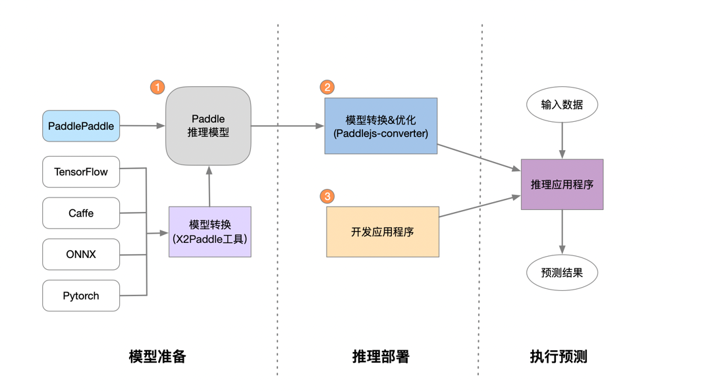

# Paddle.js 预测流程

Paddle.js 是一个高性能、轻量级、灵活性强且易于扩展，运行在浏览器中的开源深度学习框架。目前，Paddle.js 可以在支持 webGL/webGPU 的浏览器中运行。



## 一、模型准备

Paddle.js 框架支持模型结构为PaddlePaddle深度学习框架产出的模型格式。 

如果您手中的模型是由诸如Caffe、Tensorflow、PyTorch等框架产出的，那么您可以使用 X2Paddle 工具将模型转换为 PadddlePaddle 格式。

## 二、模型转换&优化

paddlejs-converter 是适用于 Paddle.js 的模型转换工具，其作用是将 PaddlePaddle 模型转化为浏览器友好的格式，以供Paddle.js在浏览器等环境中加载预测使用。

paddlejs-converter 还提供了强大的模型优化能力，帮助开发者对模型结构进行优化，提高运行时性能。

详见 [paddlejs-converter](https://github.com/PaddlePaddle/Paddle.js/blob/master/packages/paddlejs-converter/README_cn.md)

## 三、开发应用程序

Paddle.js 提供简单、易用的API，简单几步即可完成预测：

1、安装`@paddlejs/paddlejs-core`和`@paddlejs/paddlejs-backend-webgl`npm包，执行命令：
``` bash
npm install @paddlejs/paddlejs-core @paddlejs/paddlejs-backend-webgl
```

2、引入npm包`paddlejs-core`和`paddlejs-backend-webgl`模块
``` js
// Import @paddlejs/paddlejs-core
import { Runner } from '@paddlejs/paddlejs-core';
// Import the registered WebGL backend.
import '@paddlejs/paddlejs-backend-webgl';
```

3、创建 Runner 实例，需要传入 模型路径、输入shape宽高等参数
``` js
const runner = new Runner({
    // model path, e.g. http://xx.cc/path, http://xx.cc/path/model.json, /localModelDir/model.json, /localModelDir
    modelPath: '/model/mobilenetv2',
    // input shape
    feedShape: { 
        fw: 256,
        fh: 256
    }
});
```

4、模型预热，调用`runner.init()`方法完成Paddle.js 引擎初始化
``` js
// init runner
await runner.init();
```

5、模型预测，调用`runner.predict(mediadata, callback?)`方法执行模型预测，获得模型预测结果
``` js
// predict and get result
const res = await runner.predict(mediadata, callback?);
```

了解更多详见 [paddlejs-core](https://github.com/PaddlePaddle/Paddle.js/blob/master/packages/paddlejs-core/README_cn.md)

您可以直接使用封装好的模型 SDK，提供开箱即用的 AI 能力：

- [人像分割](https://github.com/PaddlePaddle/Paddle.js/blob/master/packages/paddlejs-models/humanseg/README_cn.md)

- [物品分类](https://github.com/PaddlePaddle/Paddle.js/blob/master/packages/paddlejs-models/mobilenet/README_cn.md)

- [文本检测](https://github.com/PaddlePaddle/Paddle.js/blob/master/packages/paddlejs-models/ocrdetection/README_cn.md)

- [手势识别](https://github.com/PaddlePaddle/Paddle.js/blob/master/packages/paddlejs-models/gesture/README_cn.md)


