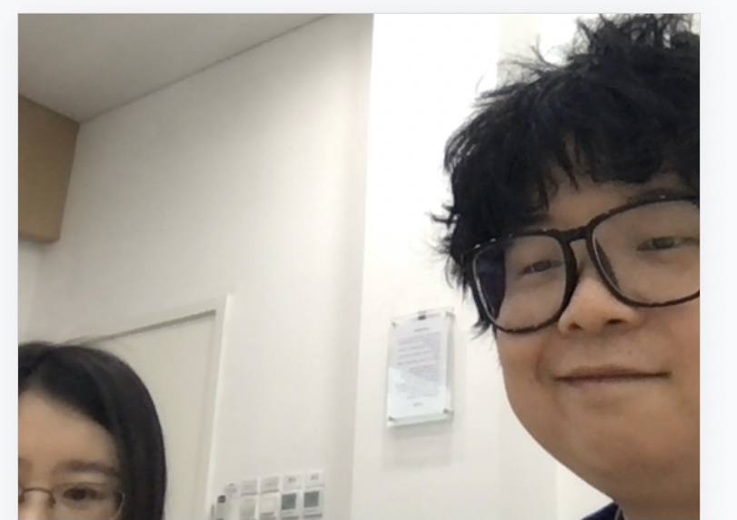
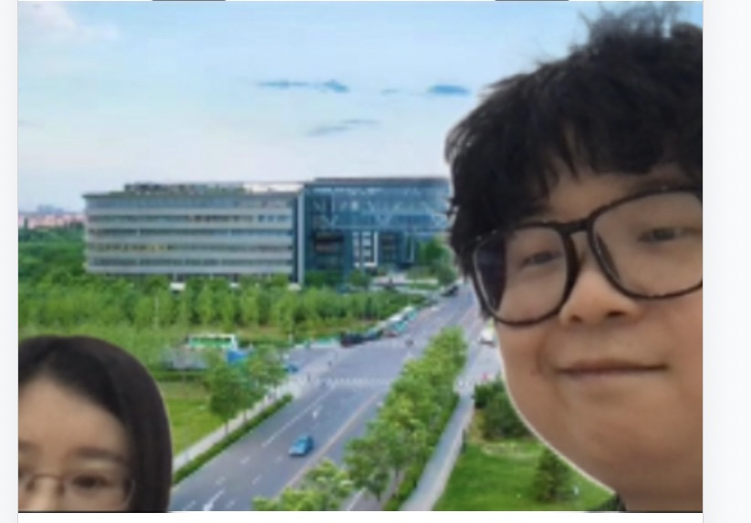
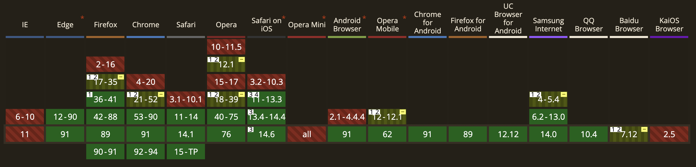

# humanStream示例demo

## 1.介绍
本示例为humanStream示例demo，通过使用人像分割模型 js 库 [@paddlejs-models/humanseg](https://github.com/PaddlePaddle/Paddle.js/tree/master/packages/paddlejs-models/humanseg)完成对视频流的实时人像分割，改变人物背景。

## 2. 项目启动

### 2.1 要求
* 安装 Node （https://nodejs.org/zh-cn/download/）
* 确认是否安装成功，在命令行执行
```sh
# 显示所安 node 版本号，即表示成功安装
node -v
```
### 2.2 步骤
```sh
# clone Paddle.js
git clone https://github.com/PaddlePaddle/Paddle.js.git

# 进入 humanStream 目录，安装依赖
cd Paddle.js/packages/paddlejs-examples/humanStream && npm install

# 执行命令
npm run dev

# 访问  http://localhost:8866/ ，即可体验人像分割处理图片应用
```

如果启动浏览器后，一直停留在 loading 状态，请查看是否允许  http://localhost:8866/ 访问摄像头，chrome 配置入口如下：


### 2.3 效果展示




## 3. 细节说明

## 3.1 @paddlejs-mediapipe/camera 介绍
npm 库 [@paddlejs-mediapipe/camera](https://github.com/PaddlePaddle/Paddle.js/tree/master/packages/paddlejs-mediapipe/camera) 对摄像头调起和视频流获取做了封装，自动对环境进行检测，选择能够使用的API，如果环境不满足需求会在控制台打印报错信息。

## 3.2 @paddlejs-models/humanseg 介绍
npm 库 [@paddlejs-models/humanseg](https://github.com/PaddlePaddle/Paddle.js/tree/master/packages/paddlejs-models/humanseg) 封装了前端推理引擎 [Paddle.js](https://github.com/PaddlePaddle/Paddle.js) 和计算方案 [paddlejs-backend-webgl](https://github.com/PaddlePaddle/Paddle.js/tree/master/packages/paddlejs-backend-webgl)，该计算方案通过 WebGL 获得 GPU 加速。
所以只需引入库 @paddlejs-models/humanseg 即可，无需再额外引入推理引擎和计算方案。

## 3.3 webpack端口号配置
本地服务使用webpack-dev-server启动，默认端口号为8866，如该端口号被占用，可在webpack.config.js中自行修改

## 3.4 环境说明
建议使用如下环境（pc端未做适配，为方便查看pc建议使用手机模式）


## 3.5 loading什么时候消失？
模型第一次加载会有预热，导致第一次加载时间比较长，加载完成会自动去除loading，如长时间loading未消失，可在控制台查看是否环境有问题，导致无法调起摄像头。

## 4. 在线体验

弹幕效果：https://paddlejs.baidu.com

视频流效果：https://paddlejs.baidu.com/humanStream
